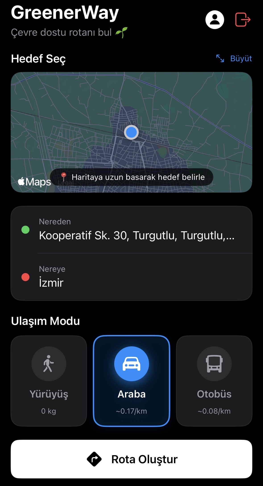
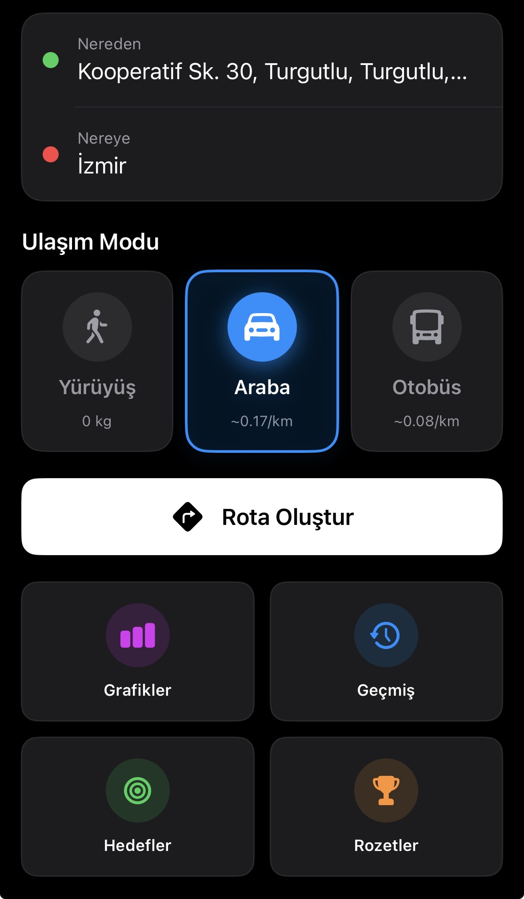
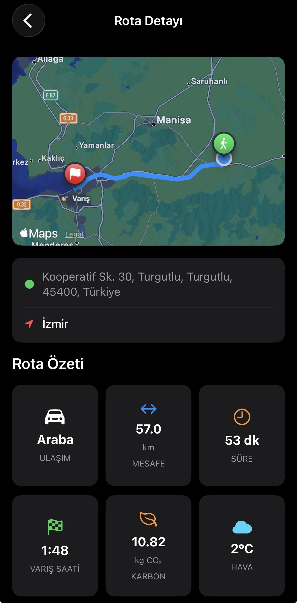
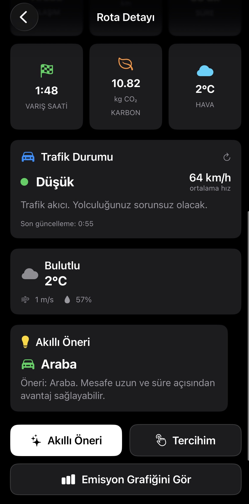
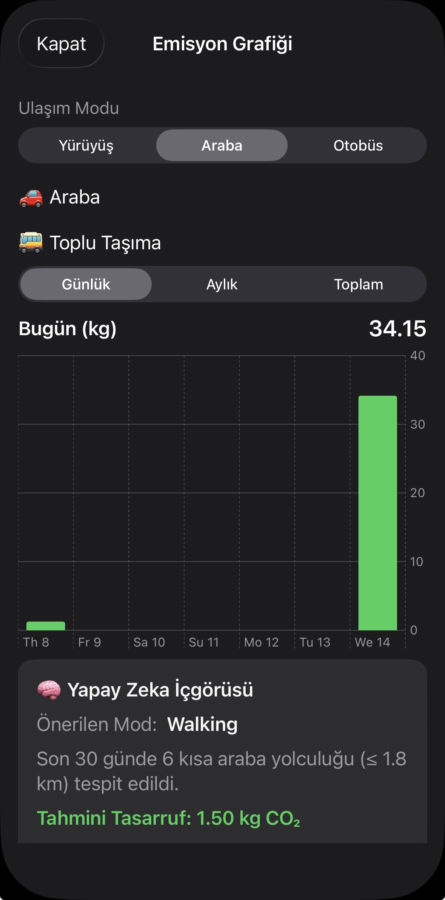
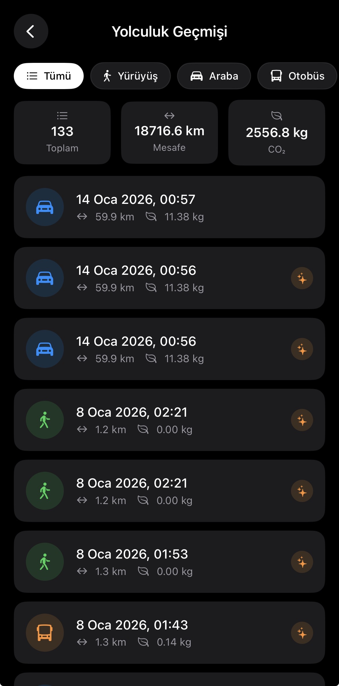
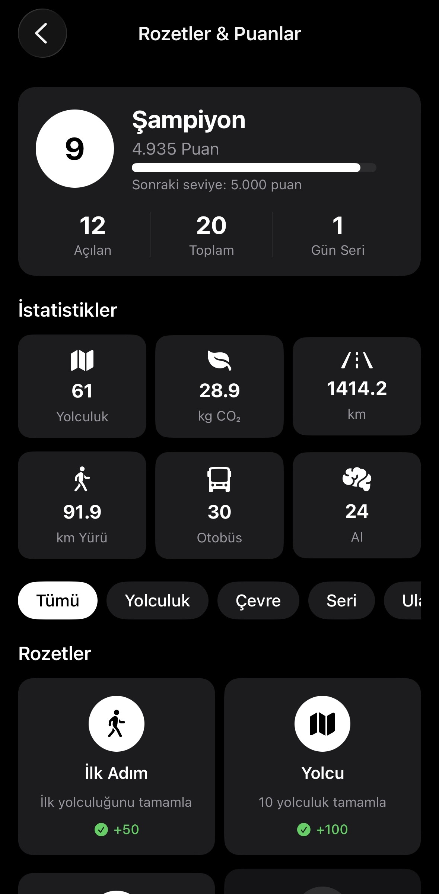
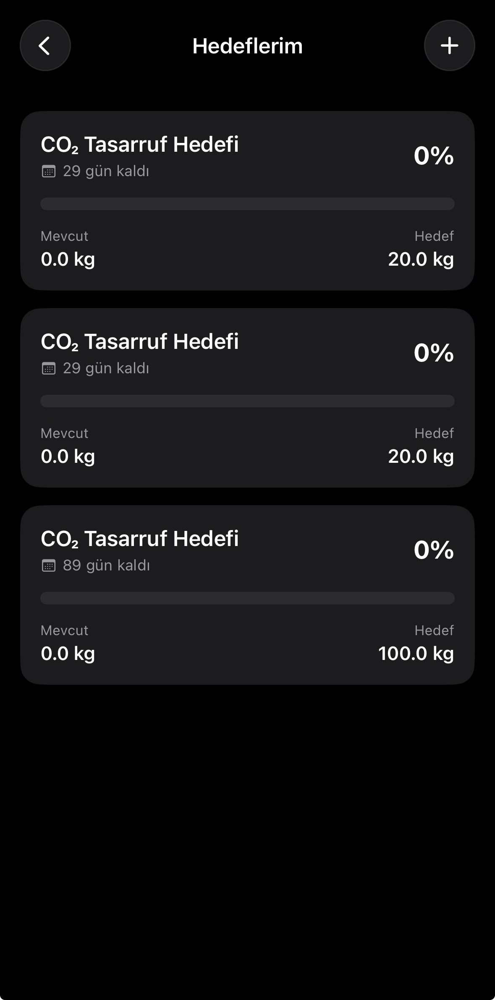

# GreenerWay 🌿

GreenerWay is an AI-powered iOS application designed to help individuals understand, track, and reduce their carbon footprint through intelligent analysis of daily habits and location-aware activity signals. By combining environmental impact estimation with machine learning–assisted insights, the app transforms everyday actions into measurable sustainability metrics. GreenerWay then delivers personalized, data-driven recommendations that encourage users to make smarter, greener choices and build long-term eco-friendly routines.


## 📱 Screenshots

<table style="width:100%">
  <tr>
    <td align="center"><b>Login & Onboarding</b></td>
    <td align="center"><b>Route Search</b></td>
    <td align="center"><b>Route Options</b></td>
  </tr>
  <tr>
    <td></td>
    <td></td>
    <td></td>
  </tr>
  <tr>
    <td align="center"><b>Route Details</b></td>
    <td align="center"><b>Details & Map</b></td>
    <td align="center"><b>Emission Analysis</b></td>
  </tr>
  <tr>
    <td></td>
    <td></td>
    <td></td>
  </tr>
  <tr>
    <td align="center"><b>Travel History</b></td>
    <td align="center"><b>Gamification & Badges</b></td>
    <td align="center"><b>Goals Screen</b></td>
  </tr>
  <tr>
    <td></td>
    <td></td>
    <td></td>
    <td></td>
  </tr>
</table>

## 📖 Overview
Many people are unaware of the environmental impact of their everyday habits. GreenerWay makes this impact measurable and understandable, then guides users toward more sustainable choices with actionable recommendations.

## ✨ Key Features
- **AI/ML-assisted carbon footprint estimation**
- **Personalized sustainability recommendations**
- **Route search and route detail flows**
- **Emissions and insights screens**
- **Travel history tracking view**

## 🛠 Tech Stack
- **SwiftUI**
- **MVVM Architecture**
- **AI / Machine Learning**
- **CoreLocation**
- **Firebase** (Authentication / Firestore — if enabled)

## 🚀 Getting Started

### Requirements
- Xcode (latest stable recommended)
- iOS Simulator or a physical iPhone

### Run Locally

1. **Clone the repository:**
   ```bash
   git clone [https://github.com/bkrgms/GreenerWay.git](https://github.com/bkrgms/GreenerWay.git)
   cd GreenerWay
2. Open the project in Xcode:

Open GreenerWay.xcodeproj

3. (Optional) Firebase setup:

Add GoogleService-Info.plist if the project uses Firebase.

Ensure the Bundle Identifier matches your Firebase configuration.

4. Run the app on an iOS Simulator or a physical device.
